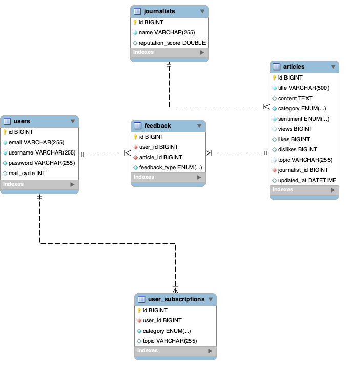

# news-article-project
### 프로젝트 제목 및 간단한 설명
+ 프로젝트의 제목은 news-article-project이다.
+ 웹상에 있는 기사들을 크롤링하고 사용자가 그 기사를 읽을 수 있게 한다.
+ 만약 이 기사에서 다룬 아이템을 다른 기사에서 다루지만 이 아이템에 대한 논조가 다를 경우 사용자에게 논조가 다른 기사를 추천한다.
+ 만약 사용자가 특정 아이템에 관심이 있을 경우 그 아이템을 다룬 기사들을 일정한 주기로 사용자 이메일에 보내도록 한다.

## Database Model

아래는 데이터베이스 모델의 ERD입니다.

### 목표
+ 요즘 개인추천이 잘되어 있어 사람들은 자신이 관심있어하는 분야의 정보를 얻기가 쉽다.
+ 예를들어 유튜브에서 연예인에 대해 부정적으로 말하는 동영상을 본다면 그것에 대해 다루는 동영상들이 유튜브에 노출된다.
+ 나는 사람들이 이런 한쪽 시각에 너무 쉽게 노출되어 다른 시각을 보지 않는다고 생각한다.
+ 이 프로젝트의 목표는 사람들이 쉽게 어떤 아이템에 대해 부정적이거나 긍적적인 논조의 기사를 접할때 그 아이템에 대해 다른 논조의 기사를 쉽게 접하게 하여 균형된 시각을 갖는데 도움을 주는 것이 목표이다.

### 주요 기능
+ 웹 상에 있는 기사들을 크롤링하고 그 기사의 아이템과 논조를 분석하여 이것을 포함한 내용을 database에 저장
+ 기사 검색 기능
+ 기사의 논조와 다른 기사를 추천하고 그 기사의 링크를 줌
+ 만약 사용자가 특정 아이템에 관심이 있을 경우 그 아이템을 다룬 기사들을 일정한 주기로 사용자 이메일에 보내도록 한다.
